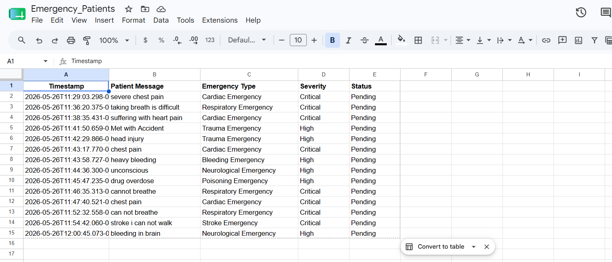

# **AI-Powered Hospital Emergency Detection Chatbot**

An intelligent healthcare assistant built with n8n and OpenAI that provides patient-friendly health guidance, detects medical emergencies in real time, and automatically logs emergency cases into Google Sheets for hospital monitoring and triage management.

---

# **🏥 Overview**

This project simulates a real-world hospital AI assistant that helps patients through a conversational chatbot interface.

The system can:

- Answer general health and wellness questions
- Detect emergency symptoms using AI + intelligent keyword routing
- Categorize emergency types
- Prioritize cases using severity levels
- Automatically track emergency patients in Google Sheets
- Provide instant emergency guidance

---

# **✨ Key Features**

## **🤖 AI Health Assistant**
Provides concise, patient-friendly health guidance for:
- Diet plans
- Wellness tips
- Common symptoms
- Lifestyle recommendations

---

## **🚨 Emergency Detection Engine**
Automatically detects serious symptoms such as:
- Chest pain
- Breathing difficulty
- Stroke symptoms
- Heavy bleeding
- Seizures
- Allergic reactions
- Trauma injuries
- Mental health crises

---

## **📊 Hospital Emergency Monitoring**
Emergency cases are automatically logged into Google Sheets with:
- Timestamp
- Patient message
- Emergency category
- Severity
- Status

This enables hospital staff to monitor critical patients in real time.

---

## **🧠 Smart Triage Logic**
Classifies emergency cases into:
- Cardiac Emergency
- Respiratory Emergency
- Neurological Emergency
- Trauma Emergency
- Mental Health Crisis
- And more...

---

## **⚡ Dynamic Routing**
- Normal health queries → AI assistant response
- Emergency cases → Hospital monitoring workflow

---

# **🧱 Workflow Architecture**

```text
Patient Chat
      ↓
Safety Check & Categorization
      ↓
Emergency Router

TRUE (Emergency)
      ↓
Append Row in Google Sheets
      ↓
Emergency Response

FALSE (Normal)
      ↓
Health Information AI
      ↓
Format Health Response

      ↓
Merge
      ↓
Respond to Chat

# **🛠️ Tech Stack**

| **Technology** | **Purpose** |
|---|---|
| **n8n** | Workflow Automation |
| **OpenAI GPT** | AI Health Assistant |
| **Google Sheets** | Emergency Tracking |
| **JavaScript** | Emergency Detection Logic |
| **Hosted Chat** | Patient Interface |

# **📋 Example Scenarios**

## **✅ Normal Query**

### **Patient:**
suggest BP diet

### **Chatbot:**
Reduce salt intake and avoid processed foods. Eat fruits, vegetables, whole grains, and lean proteins. Stay hydrated and exercise regularly.

---

## **🚨 Emergency Query**

### **Patient:**
can not breath

### **Workflow:**
- Emergency detected
- Google Sheet updated
- Emergency response sent

### **Chatbot:**
🚨 Breathing difficulty may indicate a medical emergency.

Please seek immediate medical attention immediately.

## 📊 Google Sheets Emergency Tracker

| Timestamp | PatientMessage | EmergencyType | Severity | Status |
| --- | --- | --- | --- | --- |
| 2026-05-26 10:30 AM | I have severe chest pain | Cardiac Emergency | Critical | Pending |
| 2026-05-26 10:42 AM | can not breath | Respiratory Emergency | Critical | Pending |
| 2026-05-26 11:05 AM | My father fainted suddenly | Neurological Emergency | High | Pending |
| 2026-05-26 11:20 AM | Heavy bleeding after accident | Trauma Emergency | Critical | Pending |

## 📊 Google Sheets Emergency Tracker


